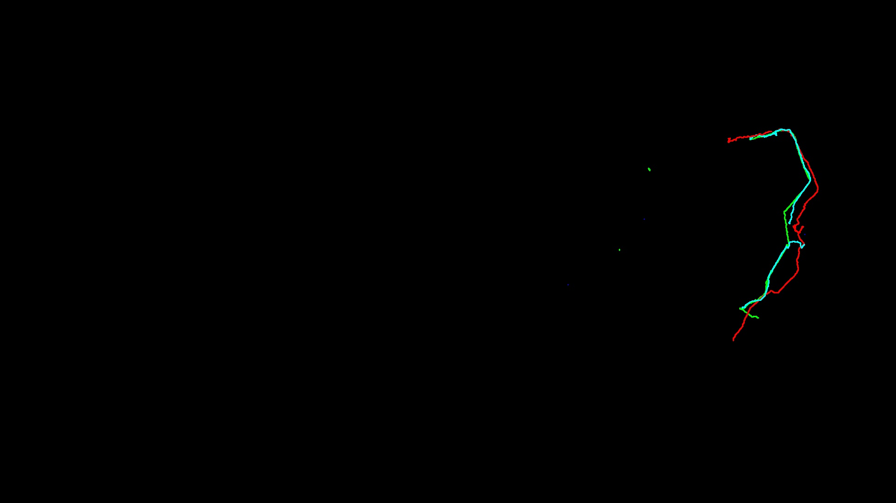

# ANSWER

## 效果展示

---

## 开发日志
| 日期     | 模块 | 内容                                                                                                                                                                                                                                                                     |
|--------|---|------------------------------------------------------------------------------------------------------------------------------------------------------------------------------------------------------------------------------------------------------------------------|
| 260510 | 数据分析 | 1. 由于飞书提供的视频分辨率仅有 480P，存在模糊情况，作为数据源很难完成本次任务    2. 考虑是否需要对视频进行处理，比如增加 object 的清晰度，或者使用其他数据集 → 重新录制官方直播视频（1080P）                                                                                                                                                   |
| 260510 | 数据处理 | 1. 对视频进行帧抽取（保存至 `datasets/frames` 下），并进行人工初步去除非法帧（保存至 `datasets/frames` 下）【`utils/frame_extractor.py`】    2. 对画面进行提取两个 ROI（减少计算量，不做整张图的训练）——右侧地图区域 + 左侧第一视角区域【`utils/roi_extractor.py`】   a. 右侧区域：玩家检测、玩家跟踪、轨迹生成、转向检测、热力图  b. 左侧区域（事件检测）：开火检测、拾取检测、击杀检测 |
| 260510 | 数据标注 | 1. 使用 Roboflow 进行数据标注，方便数据集管理、扩展、生成    2. 标注战队圆点（目前仅标注白色战队，如果需要各个战队，可以新增类别或者全部圆点为一类，后处理 HSV 以此区分战队）                                                                                                                                                              |
| 260511 | 模型训练 | 使用矩池云平台训练 YOLO2026 模型                                                                                                                                                                                                                                                  |
| 260511 | 选手检测 | 见【`detector.py`】                                                                                                                                                                                                                                                       |
| 260511 | 轨迹跟踪 | 见【`tracker.py`】                                                                                                                                                                                                                                                        |
| 260511 | 轨迹平滑 | 见【`trajectory.py`】                                                                                                                                                                                                                                                     |
| 260511 | 可视化 | 见【`visualizer.py`】                                                                                                                                                                                                                                                     |
| 260511 | 主程序 | 见【`main.py`】                                                                                                                                                                                                                                                           |
| 260511 | 模型优化 | 数据集质量检查，尤其是被选手名字挡住的圆点，因为初版轨迹发现被挡住容易漏检                                                                                                                                                                                                                                  |
| 260512 | 后续规划 | 轨迹分析、热力图绘制、战术分析、事件时序分析、Web 可视化展示、模型部署优化                                                                                                                                                                                                                                |                                                                                                                                     |

---

## 技术栈

- **视频处理**：OpenCV
- **目标检测**：YOLOv8 (ultralytics)
- **目标跟踪**：卡尔曼滤波 + IOU匹配
- **轨迹平滑**：卡尔曼滤波
- **轨迹分析**：NumPy向量计算
- **可视化**：OpenCV + Matplotlib
- **数据输出**：Pandas

